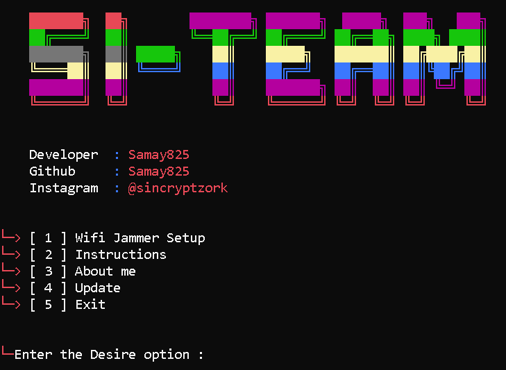

I put here the deobfuscated code (deobf.py).
You have the way to deobf the code in way.py

# Node-MCU WIFI-JAMMER SETUP 
 

- What is NODE-MCU WIFI-JAMMER   ?
> This is node mcu setup script you can easily setup with this , wifi jammer.
> Many times you just want to annoy or play a prank on your friends you can jam their wifi networks by their permission.
> If you find yourself in that situation then this Node-Mcu wifi jammer setup is the perfect tool for you!
> You can jam 4g networks wifi . This awesome script and all setup coding credit goes to @SpacehuhnTech.
> this Setup made by @samay825 

 

- Node-MCU Wifi Jammer Features

* `Jam unlimited 4g wifi networks.`

* `Supports newest Android also.`

* `Instant Deauther and clone any 4g wifi networks.`

* `Working with all Operators/Carriers.`

* `No missing code issues, all systems of wifi jammer works.`

*  For 5g Network jammer Contact my  Instagram : sincryptzork

 

- Support

> `Only Windows`

> `Script will be updated in future.`

> `Deauther wifi clones,SSID etc.`
 
  

- Installation & Step's
 
> `apt update && apt upgrade`

> `git clone https://github.com/samay825/NodeMCU-WifiJammer`
 
> `cd NodeMCU-WifiJammer`  
 
> `python3 main.py`

 
